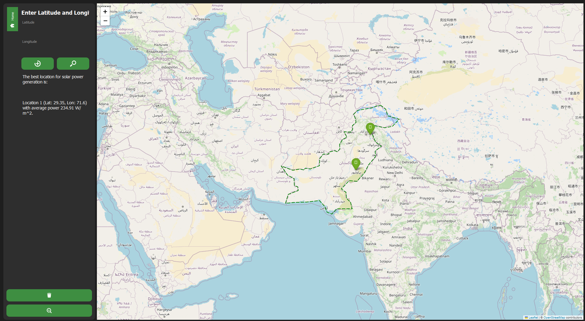

# Solar Power Prediction using LightGBM

## Project Overview
This project focuses on predicting solar power output (`P_solar`) using meteorological and irradiance data. The model leverages **LightGBM**, a gradient boosting framework, to enhance accuracy. The dataset includes various environmental factors such as temperature, humidity, wind speed, and solar radiation. The dataset has been specifically used from Pakistan's major cities, including **Islamabad, Karachi, Lahore, Khuzdar, Quetta, Bahawalpur**, and others.

## Features
- **Data Preprocessing:** Handling missing values and feature engineering (time-based cyclic features).
- **Exploratory Data Analysis (EDA):** Visualization using correlation matrices and missing value heatmaps.
- **Model Training:** Hyperparameter tuning using Randomized Search CV.
- **Performance Evaluation:** Metrics such as RMSE, MAE, R² Score, and MAPE.
- **Predictions & Error Analysis:** Saving results and trained models for future use.

## Dataset Description
The dataset consists of meteorological parameters and solar power measurements collected from major cities in Pakistan. Key features include:
- **time** (Timestamp of measurement)
- **ghi_pyr** (Global Horizontal Irradiance)
- **dni** (Direct Normal Irradiance)
- **dhi** (Diffuse Horizontal Irradiance)
- **air_temperature** (Ambient temperature in Celsius)
- **relative_humidity** (Humidity percentage)
- **wind_speed & wind_speed_of_gust** (Wind velocity in m/s)
- **wind_from_direction** (Wind direction in degrees)
- **wind_from_direction_st_dev** (Standard deviation of wind direction)
- **barometric_pressure** (Atmospheric pressure in hPa)
- **sensor_cleaning** (Indicates if sensor cleaning occurred)
- **actual_date** (Date of measurement)
- **day_length** (Length of the day in minutes)
- **latitude & longitude** (Geospatial data of the measurement location)
- **P_solar** (Target variable: Solar power output)

## Installation & Setup
### 1️⃣ Clone the Repository
```sh
git clone https://github.com/Shameerisb/Solar_Energy_Recommendation.git
cd Solar-Power-Prediction
```

### 2️⃣ Install Dependencies
```sh
pip install -r requirements.txt
```

### 3️⃣ Train the Model
To train the model, execute the following notebooks in order:
```sh
jupyter notebook LGBM_parameters.ipynb
jupyter notebook LGBM_pout.ipynb
```
This will save the trained model files.

### 4️⃣ Run the Prediction Model
After training, you can run the interactive GUI to get solar power predictions:
```sh
python main.py
```
If you just want to test the project without training, you can directly run:
```sh
python main.py
```
This will provide solar output predictions for major cities in Pakistan.

## Model Training & Evaluation
- The dataset is split into training (70%) and testing (30%).
- **LightGBM** is used with hyperparameter tuning via **Randomized Search CV**.
- Performance Metrics:
  - **Mean Absolute Error (MAE)**
  - **Root Mean Squared Error (RMSE)**
  - **R² Score**
  - **Mean Absolute Percentage Error (MAPE)**

## Results & Performance
### Correlation Matrix


The above image represents the correlation matrix between various meteorological and irradiance parameters used in the training process. This helps identify relationships between features and their impact on solar power prediction.

### GUI Interface

The image above showcases the finalized interactive GUI used for solar power predictions. Users can input environmental parameters and receive real-time predictions based on the trained LightGBM model.

## Future Improvements
- Integration with **real-time data feeds**.
- Improvements in GUI using latest GUI tools.
- Improved comparison of LGBM with LSTM and DRL.

---
# Contributors

- Shameer Ashraf - shameerisb@gmail.com
- Muhammad Talha Hassan - mhassan.bee22seecs@seecs.edu.pk

